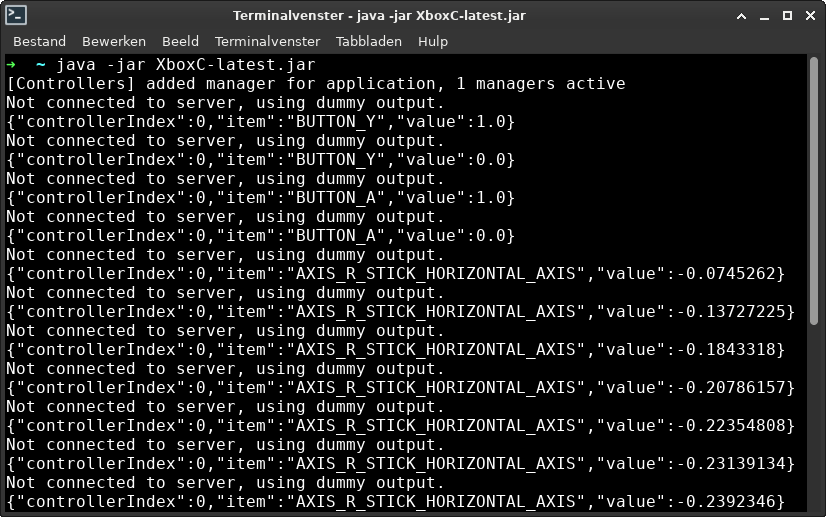

# Game controller support for your projects

This is a simple application written in Java with LibGDX that takes controller input from an xbox controller or one of the various cheap copies and communicates these events over a web socket. Your project will have to act as a socket server to receive these messages. Examples are provided below.

## 1. If you just want to quickly add game controller support to your project
 
### 1.1 Make sure to have Java installed on your system

I have only tested it with openjdk 11. It will defenitely not work with Java 7 or lower.

### 1.2 Download the latest version 

Get it here: [XboxC-latest.jar](readmeResources/XboxC-latest.jar). 

### 1.3 Run it

#### 1.3.1 From the terminal

Run `java -jar XboxC-latest.jar`. This launches the program and when you push some buttons on your game controller these events are shown in the terminal window as well with colourfull markers on the application window.

#### 1.3.2 From a graphical file manager

XboxC is packaged as a runnable jar, so if you make it runnable with `chmod +x` you can just double click to open it up.

> There are only 4 colourfull markers but there is no limit on how many controllers you can use simultaniously. (Probably, I still have to test that... I promise that if this is not the case I'll fix it quickly.)

### 1.4 Add a web socket server to your application

TODO
TODO
TODO

## 2. I you want to get your hands dirty

If you find a bug or just want to change the hardcoded IP and PORT values to something that fits you better you can download or clone the project and make some changes.

Make a pull request for bugs, please.

### 2.1 Import the project

In your IDE you can import as existing Gradle project.

### 2.2 Run it from your IDE

Create a run configuration and set `R2L.XboxC/desktop/src/be/r2l/xboxc/desktop/DesktopLauncher.java` as your Main class. Then it should run just fine.

## 2.3 Build it

I did not get it to build from my IDE, in this case Eclipse. Probably because I'm a noob that doesn't know his tools. What does work is executing `./gradlew desktop:dist` from the project root. This creates an executable jar in `/R2L.XboxC/desktop/build/libs/`.

> make sure to have sourceCompatibility at 1.8 or higher, I use 11, or it will not work. Set these values in `core/build.gradle` and `desktop/build.gradle`.
