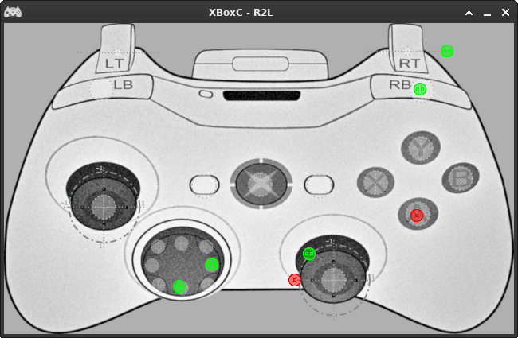

# Easily add controller support to your project

This is a simple application written in Java with LibGDX that takes controller input from an xbox controller or one of the various cheap copies and communicates these events over a web socket. Your project will have to act as a socket server to receive these messages. Examples are provided below.

## Download

Download the latest build [here](readmeResources/xboxc-0.1.jar)

## Run
- from terminal execute `java -jar xboxc-0.1.jar`
- from a file browser `chmod +x` the jar and double click it

The program is a window with the image of an xbox controller, when input is detected it is shown with a coloured marker. There are 4 colours of markers but there is no limit on how many controllers you can use.

## Build
- make sure to have sourceCompatibility at 1.8 or higher, I use 11. This can be set in the IDE for the project or in the files `core/build.gradle` and `desktop/build.gradle`.
- When exporting as executable jar in Eclipse make sure the `mainClassName` parameter is set to `be.r2l.xboxc.desktop.DesktopLauncher`
- from the project directory execute `./gradlew desktop:dist`, this creates an executable jar in `/R2L.XBOXC/desktop/build/libs/`.