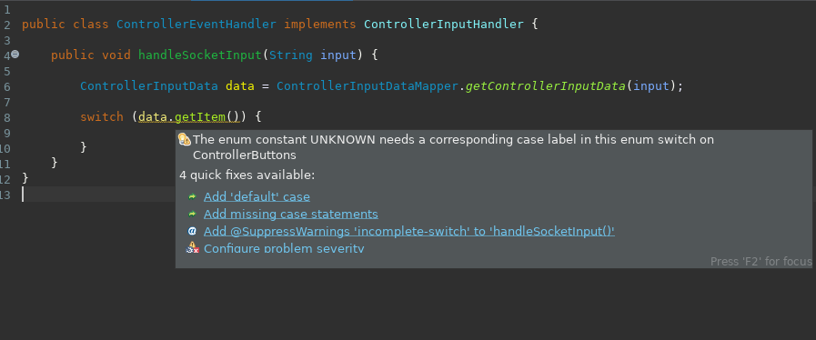

# Game controller support for your projects

This is a simple application written in Java with LibGDX that takes controller input from an xbox controller or one of the various cheap copies and communicates these events over a web socket. Your project will have to act as a socket server to receive these messages. Examples are provided below.

## 1. Quickly add game controller support to your project
 
### 1.1 Make sure to have Java installed on your system

You can program your app in any language you like but the game controller client is written in Java so you'll need Java on your system to run it.

I have only tested it with openjdk 11. It will defenitely not work with Java 7 or lower. 

### 1.2 Download the latest version 

Get it here: [XboxC-latest.jar](readmeResources/XboxC-latest.jar). 

### 1.3 Run it

#### 1.3.1 From the terminal

Run `java -jar XboxC-latest.jar`. This launches the program and when you push some buttons on your game controller these events are shown in the terminal window as well with colourfull markers on the application window.


#### 1.3.2 From a graphical file manager

XboxC is packaged as a runnable jar, so if you make it runnable with `chmod +x` you can just double click to open it up.

> There are only 4 colourfull markers but there is no limit on how many controllers you can use simultaniously. (Probably, I still have to test that... I promise that if this is not the case I'll fix it quickly.)

## 2. Add a web socket server to your application

Using XboxC should make using game controllers in your project a lot easier but you still need to run a socket server and write a handler for the input.

XboxC defaults to trying to connect to `127.0.0.1` on port `8099`. These are hardcoded but you can change them in SocketClient.java and package a new jar, instructions are provided below.

Your project will have to start a socket server and listen for input. Every event is sent as a JSON string, ie:

> {"controllerIndex":1,"item":"BUTTON_A","value":1.0}

Below are examples for:
 - Java
 - Kotlin
 - Python
 - ...

### Java

Add [XboxC-latest.jar](readmeResources/XboxC-latest.jar). to your classpath.

Write a `ControllerEventHandler` that implements `ControllerInputHandler`. This class can be empty for now as the ControllerInputHandler interface provides a default method.

```Java
public class ControllerEventHandler implements ControllerInputHandler {

}
```

Use an instance of `ControllerEventHandler` as parameter to start the server:

```Java
public class Main {
	public static void main(String[] args) {
		ControllerInputHandler inputHandler = new ControllerEventHandler();
		new Server().start(inputHandler);
	}
}
```

Run your program and run XboxC-latest.jar, push some buttons and the console in your IDE should output something like this:
```
controller :0: BUTTON_X - 1.0
controller :0: AXIS_R_STICK_HORIZONTAL_AXIS - -0.26276436
controller :0: AXIS_R_STICK_HORIZONTAL_AXIS - -0.28629413
controller :0: AXIS_R_STICK_HORIZONTAL_AXIS - -0.3255104
controller :0: AXIS_R_STICK_VERTICAL_AXIS - -0.41178626
controller :0: AXIS_R_STICK_VERTICAL_AXIS - -0.39609975
controller :0: AXIS_R_STICK_HORIZONTAL_AXIS - -0.33335367
controller :0: AXIS_R_STICK_VERTICAL_AXIS - -0.34119692
controller :0: AXIS_R_STICK_VERTICAL_AXIS - -0.24707785
controller :0: AXIS_R_STICK_HORIZONTAL_AXIS - -0.2941374
controller :0: AXIS_R_STICK_VERTICAL_AXIS - -0.09805597
controller :0: BUTTON_R_BUMPER - 0.0
controller :0: AXIS_R_STICK_HORIZONTAL_AXIS - 0.003906369
controller :0: AXIS_R_STICK_VERTICAL_AXIS - 0.003906369
controller :0: BUTTON_X - 0.0
controller :0: BUTTON_R_BUMPER - 1.0
controller :0: BUTTON_R_BUMPER - 0.0
```
This is output by the default method in the `ControllerInputHandler` interface.

> Note that if you end the server program, the client keeps running but is unable to connect to a newly started server. Therefore restart the client every time you launch the server.

Now we can override the `handleSocketInput` method from the `ControllerInputHandler` interface.

```Java
public class ControllerEventHandler implements ControllerInputHandler {
	public void handleSocketInput(String input) {
		System.out.println(input);
	}
}
```

Start the server and restart the client, now we log the raw input. These are Strings with JSON formatted data.

```
{"controllerIndex":0,"item":"BUTTON_B","value":1.0}
{"controllerIndex":0,"item":"BUTTON_Y","value":1.0}
{"controllerIndex":0,"item":"AXIS_R_STICK_HORIZONTAL_AXIS","value":-0.23139134}
{"controllerIndex":0,"item":"AXIS_R_STICK_VERTICAL_AXIS","value":-0.17648853}
{"controllerIndex":0,"item":"AXIS_R_STICK_HORIZONTAL_AXIS","value":-0.28629413}
{"controllerIndex":0,"item":"AXIS_R_STICK_HORIZONTAL_AXIS","value":-0.34904018}
{"controllerIndex":0,"item":"AXIS_R_STICK_VERTICAL_AXIS","value":-0.30198064}
{"controllerIndex":0,"item":"AXIS_R_STICK_HORIZONTAL_AXIS","value":-0.4196295}
{"controllerIndex":0,"item":"AXIS_R_STICK_VERTICAL_AXIS","value":-0.41178626}
{"controllerIndex":0,"item":"AXIS_R_STICK_HORIZONTAL_AXIS","value":-0.4745323}
{"controllerIndex":0,"item":"AXIS_R_STICK_VERTICAL_AXIS","value":-0.62355417}
{"controllerIndex":0,"item":"AXIS_R_STICK_HORIZONTAL_AXIS","value":-0.55296487}
```

We can map this JSON to an object of type `ControllerInputData`.

```Java
public class ControllerEventHandler implements ControllerInputHandler {
	public void handleSocketInput(String input) {
		
		ControllerInputData data = ControllerInputDataMapper.getControllerInputData(input);
		
		System.out.println(data.getControllerIndex());
		System.out.println(data.getItem());
		System.out.println(data.getValue());
	}
}
```

output:
```
BUTTON_B
1.0
0
BUTTON_B
0.0
0
BUTTON_X
1.0
0
BUTTON_X
0.0
0
BUTTON_R_BUMPER
1.0
0
BUTTON_R_BUMPER
0.0
```

All possible items from `getItem` are defined in an enum called `ControllerButtons` so if you code a switch statement on the enum value:

ControllerEventHandler.java
```Java
public class ControllerEventHandler implements ControllerInputHandler {
	
	public void handleSocketInput(String input) {
		
		ControllerInputData data = ControllerInputDataMapper.getControllerInputData(input);
		
		switch (data.getItem()) {
		
		}
	}
}
```

Your IDE should alert you that you need to add a case for every enum item.



Click "add missing case statements" to let the IDE work for you.

```Java

public class ControllerEventHandler implements ControllerInputHandler {
	
	public void handleSocketInput(String input) {
		
		ControllerInputData data = ControllerInputDataMapper.getControllerInputData(input);
		
		switch (data.getItem()) {
		case AXIS_L_STICK_HORIZONTAL_AXIS:
			break;
		case AXIS_L_STICK_VERTICAL_AXIS:
			break;
		case AXIS_L_TRIGGER:
			break;
		case AXIS_R_STICK_HORIZONTAL_AXIS:
			break;
		case AXIS_R_STICK_VERTICAL_AXIS:
			break;
		case AXIS_R_TRIGGER:
			break;
		case BUTTON_A:
			break;
		case BUTTON_B:
			break;
		case BUTTON_BACK:
			break;
		case BUTTON_DPAD_DOWN:
			break;
		case BUTTON_DPAD_LEFT:
			break;
		case BUTTON_DPAD_RIGHT:
			break;
		case BUTTON_DPAD_UP:
			break;
		case BUTTON_GUIDE:
			break;
		case BUTTON_L_BUMPER:
			break;
		case BUTTON_L_STICK:
			break;
		case BUTTON_R_BUMPER:
			break;
		case BUTTON_R_STICK:
			break;
		case BUTTON_START:
			break;
		case BUTTON_X:
			break;
		case BUTTON_Y:
			break;
		case DPAD_CENTER:
			break;
		case DPAD_EAST:
			break;
		case DPAD_NORTH:
			break;
		case DPAD_NORTH_EAST:
			break;
		case DPAD_NORTH_WEST:
			break;
		case DPAD_SOUTH:
			break;
		case DPAD_SOUTH_EAST:
			break;
		case DPAD_SOUTH_WEST:
			break;
		case DPAD_WEST:
			break;
		case UNKNOWN:
			break;
		default:
			break;
		
		}
	}
}

```

That's it. You now have game controller input in your Java program.

### Kotlin

Add [XboxC-latest.jar](readmeResources/XboxC-latest.jar). to your classpath.

Write a `ControllerEventHandler` that implements `ControllerInputHandler`. This class can be empty for now as the ControllerInputHandler interface provides a default method.

```Kotlin
class ControllerEventHandler : ControllerInputHandler {

}
```
Use an instance of `ControllerEventHandler` as parameter to start the server:

```Kotlin
fun main(args: Array<String>) {
    val inputHandler: ControllerInputHandler = ControllerEventHandler()
    Server().start(inputHandler)
}
```

Run Main.kt, start XboxC and hit a few buttons on your game controller. If everything is well you should see output in the console:

```
controller :0: AXIS_R_TRIGGER - 1.0
controller :0: AXIS_R_STICK_HORIZONTAL_AXIS - -0.21570483
controller :0: AXIS_R_STICK_HORIZONTAL_AXIS - -0.019623403
controller :0: AXIS_R_STICK_VERTICAL_AXIS - 0.003906369
controller :0: AXIS_R_STICK_HORIZONTAL_AXIS - 0.003906369
controller :0: BUTTON_R_STICK - 1.0
controller :0: AXIS_R_STICK_VERTICAL_AXIS - 0.019592883
controller :0: AXIS_R_TRIGGER - 0.0
controller :0: AXIS_R_STICK_VERTICAL_AXIS - 0.02743614
controller :0: AXIS_R_STICK_VERTICAL_AXIS - 0.08233894
```
This is because the `ControllerInputHandler` has a default method that displays this information.

Now we can start writing our actual code in `ControllerEventHandler`, start by overriding the `handleSocketInput` method.

```Kotlin
class ControllerEventHandler : ControllerInputHandler {
    override fun handleSocketInput(input: String) {
        println(input)
    }
}
```

Run Main.kt again, don't forget to restart the XboxC application as it will not automatically reconnect if it loses connection to a server.

The console output should look like this:
```
{"controllerIndex":0,"item":"AXIS_R_STICK_HORIZONTAL_AXIS","value":-0.082369454}
{"controllerIndex":0,"item":"AXIS_R_STICK_HORIZONTAL_AXIS","value":0.003906369}
{"controllerIndex":0,"item":"AXIS_R_STICK_VERTICAL_AXIS","value":0.22351757}
{"controllerIndex":0,"item":"AXIS_R_STICK_VERTICAL_AXIS","value":0.29410687}
{"controllerIndex":0,"item":"AXIS_R_STICK_VERTICAL_AXIS","value":0.30195013}
{"controllerIndex":0,"item":"AXIS_R_STICK_VERTICAL_AXIS","value":0.33332315}
{"controllerIndex":0,"item":"AXIS_R_STICK_VERTICAL_AXIS","value":0.30979338}
{"controllerIndex":0,"item":"AXIS_R_TRIGGER","value":0.0}
{"controllerIndex":0,"item":"AXIS_R_STICK_VERTICAL_AXIS","value":0.24704733}
{"controllerIndex":0,"item":"BUTTON_A","value":0.0}
{"controllerIndex":0,"item":"BUTTON_R_BUMPER","value":0.0}
{"controllerIndex":0,"item":"AXIS_R_STICK_VERTICAL_AXIS","value":0.003906369}
```

These are the JSON strings that are coming in through the socket. The `XboxC-latest.jar` has an enum of all possible `item` values. First convert the input to an instance of `ControllerInputData` using the handy `ControllerInputDataMapper`.

```Kotlin
class ControllerEventHandler : ControllerInputHandler {
    override fun handleSocketInput(input: String) {
        val data: ControllerInputData = ControllerInputDataMapper.getControllerInputData(input)
        
        println(data.controllerIndex)
        println(data.item)
        println(data.value)
    }
}
```

Now you can switch based on data.item and add your actual code for each controller event.

```Kotlin
class ControllerEventHandler : ControllerInputHandler {
    override fun handleSocketInput(input: String) {
        val data: ControllerInputData = ControllerInputDataMapper.getControllerInputData(input)

        when (data.item) {
            ControllerButtons.BUTTON_A -> handleButtonA(data.controllerIndex, data.value)
            ControllerButtons.BUTTON_B -> handleButtonB(data.controllerIndex, data.value)
            //
            //Here a long list of all possible ControllerButtons
            //
            else -> {
                println("No handler defined for ${data.item}")
            }

        }
    }

    private fun handleButtonA(controllerIndex: Int, value: Float) {
        println("Controller $controllerIndex, BUTTON_A value to: $value")
    }

    private fun handleButtonB(controllerIndex: Int, value: Float) {
        println("Controller $controllerIndex, BUTTON_B value to: $value")
    }
}
```


console output:
```
Controller 0, BUTTON_A value to: 1.0
Controller 0, BUTTON_A value to: 0.0
Controller 0, BUTTON_B value to: 1.0
Controller 0, BUTTON_B value to: 0.0
No handler defined for BUTTON_X
No handler defined for BUTTON_X
No handler defined for BUTTON_Y
No handler defined for BUTTON_Y
No handler defined for BUTTON_R_BUMPER
No handler defined for BUTTON_R_BUMPER
```

### Python

This is an example Python script for a server that listens for events from XboxC.

> Start the server before launching XboxC! It waits for a client to connect, if the client is already running this won't work.

```Python
import socket
import json

def xboxc_server():
    host = "127.0.0.1"
    port = 8099

    server_socket = socket.socket()
    server_socket.bind((host, port))

    server_socket.listen(1) #we only listen to one client
    conn, address = server_socket.accept()  # accept new connection
    print("Connection from: " + str(address))

    while True:
        data = conn.recv(128).decode() #message max size 128 bytes
        print(str(data))
        
        input_event = json.loads(data)
        
        index = input_event['controllerIndex']
        item = input_event['item']
        value = input_event['value']

        print(str(index))
        print(str(item))
        print(str(value))
        print('--------------------------')


    conn.close()


if __name__ == '__main__':
    xboxc_server()
```

output:
```
0
AXIS_R_STICK_VERTICAL_AXIS
-0.67845696
--------------------------
{"controllerIndex":0,"item":"AXIS_R_STICK_VERTICAL_AXIS","value":-0.5686514}

0
AXIS_R_STICK_VERTICAL_AXIS
-0.5686514
--------------------------
{"controllerIndex":0,"item":"AXIS_R_STICK_VERTICAL_AXIS","value":-0.2941374}

0
AXIS_R_STICK_VERTICAL_AXIS
-0.2941374
--------------------------
{"controllerIndex":0,"item":"AXIS_R_STICK_VERTICAL_AXIS","value":0.003906369}

0
AXIS_R_STICK_VERTICAL_AXIS
0.003906369
--------------------------
{"controllerIndex":0,"item":"BUTTON_A","value":1.0}

0
BUTTON_A
1.0
--------------------------
{"controllerIndex":0,"item":"BUTTON_A","value":0.0}

0
BUTTON_A
0.0
--------------------------
```

### Others

If you have used it with another language I'd greatly appriciate some example code to add here in the README. If the language can handle socket communication it should work.


## 3. I you want to get your hands dirty

If you find a bug or just want to change the hardcoded IP and PORT values to something that fits you better you can download or clone the project and make some changes.

Make a pull request for bugs, please.

### 2.1 Import the project

In your IDE you can import as existing Gradle project.

### 2.2 Run it from your IDE

Create a run configuration and set `R2L.XboxC/desktop/src/be/r2l/xboxc/desktop/DesktopLauncher.java` as your Main class. Then it should run just fine.

### 2.3 Build it

I did not get it to build from my IDE, in this case Eclipse. Probably because I'm a noob that doesn't know his tools. What does work is executing `./gradlew desktop:dist` from the project root. This creates an executable jar in `/R2L.XboxC/desktop/build/libs/`.

> make sure to have sourceCompatibility at 1.8 or higher, I use 11, or it will not work. Set these values in `core/build.gradle` and `desktop/build.gradle`.
